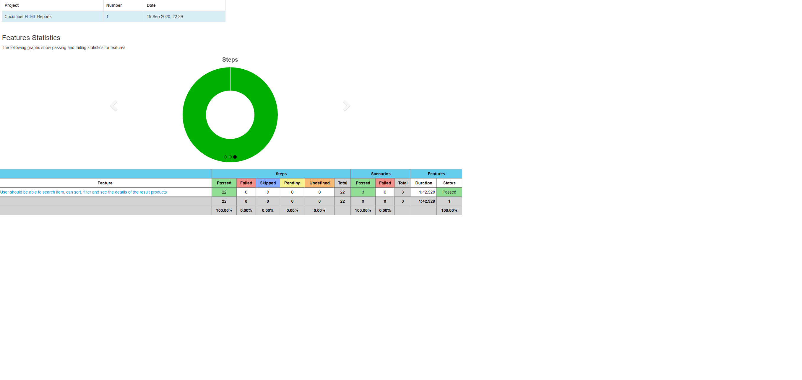
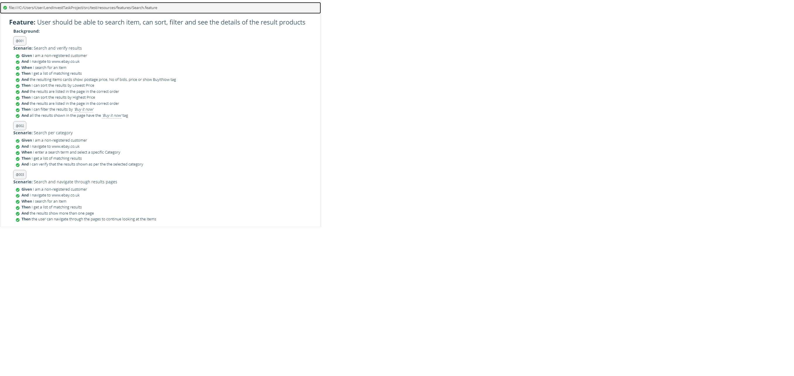

#  EBAY PROJECT EXERCISE

##### TOOLS AND EXPLANATIONS
>- The project has been prepared based on Cucumber BDD style.    
>- Maven build management tool is used in this project by Java (JDK8+) language.
>- In the project created by using the Page Object Design Pattern, the data were collected under the pages package.
>- Dependencies have been prepared under the pom.xml file. Webdriver Manager dependency was used from this project.
>- The project was tried to be controlled from the centre using config.properties and ConfigurationReader.
>- Driver based on Singleton Design Pattern was used and parallel testing was supported with driverPool. (In the pom.xml  **parallel,perCoreThreadCount,threadCountMethods**)
>- LOG4J and SL4J information is provided as a logging design.

##### HOW TO RUN TESTS
```sh
 -> Under the runner package "Runner" right click and run Runner. Also path "src > test > java > com > ebay > runner > Runner"
 -> mvn verify --> in the IDE console or navigate project path in command line and run.
```
##### HOW TO CREATE TEST REPORTS

1-) When you run tests with the **"mvn verify"** command from the console, you can see **Cucumber Html Report** under the target file.       
**-> target -> cucumber-html-reports > overview-steps.html** (open with chrome option)

2-) Second type of report, the project is run from **Runner** class, a **Cucumber Report link** is created in the IDE console automatically.       
 Sample link -> View your Cucumber Report at:   (Works 24 hours later than it will delete automatically)                                         
                 https://reports.cucumber.io/reports/5cdac488-0ae9-4599-b357-f3d6de0afdbf    

3-) The log documents are located at the project level under the **execution_log.txt** file.

4-) The driver, pom.xml and console are ready for Parallel testing. Type **mvn verify  -Dbrowser-firefox** from the console and the relevant browser will open automatically. 
The only feature is thread one.

5-) To run a special tag, when you type **@001** in the **tags** (**tags = "@001"**) section in the Runner, only that tag will work specifically. 
It also works exclusively in the console with **mvn verify -Dcucumber.options = "- tags 002"**. Also **mvn verify -Dcucumber.options = "- tags 003" -Dbrowser = chrome-headles** is another option.


**Adam Cigdem**    
QA Automation Engineer | SDET     
https://www.linkedin.com/in/adam-cigdem-2932931b4/ 



   


                 
